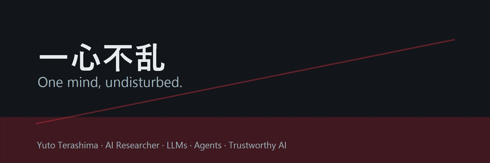

  

<h1 align="center">Yuto Terashima</h1>
<h3 align="center">AI Researcher · LLMs · Agents · Trustworthy AI</h3>

  UC Berkeley Computer Science, 2021-2025 · Google AI Intern, 2025

  <b>一心不乱 / One mind, undisturbed.</b> 
  Focused execution, rigorous evaluation, and trustworthy AI systems. 
  AI研究と剣道に通じる集中と修練。 
  以剑道的专注，打磨 AI 系统与评测。

---

## About

I am an AI researcher interested in how language models behave when they become
systems: agents that use tools, retrieve context, evaluate themselves, and operate
inside real workflows. My work focuses on practical evaluation, agent reliability,
multilingual safety, and transformer-based NLP systems.

- **Education:** UC Berkeley, Computer Science undergraduate, 2021-2025
- **Experience:** Google AI, AI Intern, 2025
- **Research taste:** careful benchmarks, readable systems, reproducible experiments
- **Practice:** Kendo, guided by **一心不乱**: disciplined attention under pressure

## Research Focus

| Area | What I build |
| --- | --- |
| LLM evaluation | Reproducible eval pipelines, rubric graders, model comparison reports |
| AI agents | Trace analysis, tool-use evaluation, reliability and failure-mode studies |
| AI safety | Multilingual safety tests, refusal/over-refusal analysis, risk taxonomies |
| Transformers | Small model experiments, attention visualization, NLP training notes |

## Selected Work

| Project | Signal |
| --- | --- |
| [agent-safety-eval-lab](https://github.com/YutoTerashima/agent-safety-eval-lab) | Flagship lab for agent traces, tool-call grading, and safety evaluation |
| [mcp-tool-security-playground](https://github.com/YutoTerashima/mcp-tool-security-playground) | Tool-use security, permission policies, and prompt-injection threat modeling |
| [rag-eval-observatory](https://github.com/YutoTerashima/rag-eval-observatory) | RAG observability with retrieval, faithfulness, and failure-case analysis |
| [multilingual-llm-safety-bench](https://github.com/YutoTerashima/multilingual-llm-safety-bench) | English/Japanese/Chinese safety mini-benchmark and model behavior report |
| [ISC-Bench-Reproduction](https://github.com/YutoTerashima/ISC-Bench-Reproduction) | Reproduction-oriented work around LLM safety and agent evaluation |
| [Transformers-Projects](https://github.com/YutoTerashima/Transformers-Projects) | Transformer/NLP project lab and experiments |

## Portfolio Matrix

| Repository | Purpose |
| --- | --- |
| [transformer-from-scratch-notes](https://github.com/YutoTerashima/transformer-from-scratch-notes) | Attention, tiny tokenizer, and mini training-loop notes |
| [llm-eval-cookbook](https://github.com/YutoTerashima/llm-eval-cookbook) | Exact match, rubric, preference, pairwise, and JSON-schema eval recipes |
| [agent-trace-viewer](https://github.com/YutoTerashima/agent-trace-viewer) | Lightweight HTML trace viewer for agent messages, tools, and failures |
| [prompt-robustness-suite](https://github.com/YutoTerashima/prompt-robustness-suite) | Prompt versioning, A/B testing, and failure clustering |
| [open-model-benchmark-cards](https://github.com/YutoTerashima/open-model-benchmark-cards) | Structured benchmark-card generator for open models |

## Languages

English · 日本語 · 中文

## Contact

- Email: [yutoterashima4@gmail.com](mailto:yutoterashima4@gmail.com)
- GitHub: [YutoTerashima](https://github.com/YutoTerashima)
